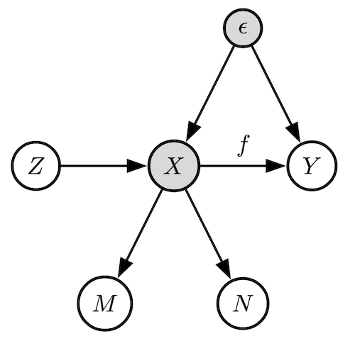

# Causal Inference with Treatment Measurement Error: A Nonparametric Instrumental Variable Approach

This is the official implementation for the publication 

Yuchen Zhu, Limor Gultchin, Arthur Gretton, Matt Kusner, Ricardo Silva **Causal Inference with Treatment Measurement Error: A Nonparametric Instrumental Variable Approach.** In Uncertainty in Artificial Intelligence (UAI) 2022.

The paper can be downloaded [here](https://arxiv.org/abs/2206.09186). 

## Overview
This paper estimates the cause-effect curve $f$ when the treatment variable $X$ is unobserved and an unobserved common cause variable between $X$ and $Y$ is also present. Unobserved or poorly observed treatments are present in many real-world settings (education, economics, medicine). The estimation requires access to two observed measurements and one instrumental variable. The scenario is described in the following directed acyclic graph. 

<p align="center">
  
</p>

The main conditions for consistent estimation for $f$ are listed. Please refer to the paper for the full set of technical conditions.

* $Y = f(X) + \epsilon$, and $\mathbb{E}[\epsilon | Z] = 0$. Additive noise model for the causal effect curve.
* $M = X + \Delta M$, $N = X + \Delta N$. Measurement noises are added.
* $\mathbb E[\Delta M | X, \Delta N] = 0$. The added noise on one measurement is uncorrelated with the true treatment; the two added noises are uncorrelated with each other.
* $X\perp \!\!\! \perp \Delta N$, $\mathbb E [\epsilon | \Delta N] = 0$. The added noise on $N$ is independent of $X$ and uncorrelated with $\epsilon$.


# Installation
First install Python 3.8, and then, the required dependencies through:
```sh
pip install -r requirements.txt
```

# Reproduce results

To reproduce the results from the paper, please run from project root directory:
```sh
python main.py <config-path> <method-name>
```

where the `<method-name>` is one of the following:

* `merrorkiv` - This is our proposed method.
* `kivm` - This runs a previous nonparametric instrumental variable regression method, but using the measurement $M$ as a replacement for $X$.
* `kivmn` - This agains runs the previous nonparametric instrumental variable regression method, using the average $M$ and $N$ as an error-reduced measurement for $X$.
* `kivoracle` - This is the previous nonparametric instrumental variable regression method using the true treatment $X$ as oracle.

# Changing the config
Each config file runs an experiment. A config file looks like

```yaml
n_repeat: 30 # int, this is the number of times to repeat runs for a given set of parameters.

train_params:
# Here are the training parameters. Our method and KIV-based methods have distinct sets of parameters:
# - Our method:
  split_ratio: 0.5 # float, the ratio to split the training data for step 1 and steps 2&3.
  lambda_mn: [0, -10] # float, regularisation parameter for learning the conditional mean embedding (CME) for (M,N) | Z.
  lambda_n: [0, -10] # float, regularisation parameter for learning the CME for N | Z.
  xi: [0, -10] # float, the range of step 3 regularisation parameter.

  lambda_x: null # null or float. If learning the step 3 regularisation parameter, set this to null. 
  n_chi: 500 # int, number of samples from khat. In the paper chi is denoted alpha, and khat is denoted q.
  batch_size: 64 # int, batch size for learning step 2.
  lr: 0.1 # float, learning rate for step 2.
  num_epochs: 5 # int, number of epochs to run the step 2 training loop for x.
  label_cutoff: 1.0 # int, cut-off threshold for the label, denoted w_MN in the paper; labels with real parts more than 1 standard deviation away from the mean are discarded.
  reg_param: 0. # int, default to 0, used in one variant using the mean of M and N to regularise the learned X.

# - KIV based methods:
  split_ratio: 0.5 # float, the ratio to split the training data for stage 1 and 2 of training.
  lambda: [0, -10] # [float, float], the range of stage 1 regularisation parameter.
  xi: [0, -10] # [float, float], the range of stage 2 regularisation parameter.

data:
# Here are the synthetic data generation parameters. For each of the synthetic datasets: linear, sigmoid and demand, the set of data parameters are distinct:
# - Linear or Sigmoid: uses a linear or sigmoid function as the ground truth cause-effect curve.
  data_name: "linear"  # or "sigmoid", str.
  data_size: 2000  # int
  m_scale: [0.5, 1., 2.]  # standard deviation of noise on measurement M
  n_scale: null # default to null, standard deviation of noise on measurement N
  bias: 0. # measurement error bias on N.
  merror_func_str: ["gaussian", "uniform", "multi_gaussian"]  # measurement error distribution, three designs are implemented: gaussian, uniform, or mixture-of-gaussian.

# - Demand: a realistic simulation of a supply-demand scenario.
  data_name: "demand"  
  data_size: 2000  # int
  rho: [0.25, 0.5, 0.9]  # [float, float, float] confounding levels
  m_scale: [0.5, 1., 2.]  
  n_scale: null
  bias: 0. 
  merror_func_str: ["gaussian", "uniform", "multi_gaussian"]  

```


# Citation
If you use the code in this repository, please cite the paper as follows:

```bibtex
@InProceedings{zhu22-mekiv,
  title = 	 {Causal inference with treatment measurement error: a nonparametric instrumental variable approach},
  author =       {Zhu, Yuchen and Gultchin, Limor and Gretton, Arthur and Kusner, Matt J. and Silva, Ricardo},
  booktitle = 	 {Proceedings of the Thirty-Eighth Conference on Uncertainty in Artificial Intelligence},
  year = 	 {2022},
  url = 	 {https://proceedings.mlr.press/v180/zhu22a.html}
}
```
