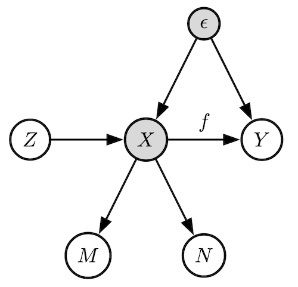

# Causal Inference with Treatment Measurement Error: A Nonparametric Instrumental Variable Approach

This is the official implementation for the publication 

Yuchen Zhu, Limor Gultchin, Arthur Gretton, Matt Kusner, Ricardo Silva. **Causal Inference with Treatment Measurement Error: A Nonparametric Instrumental Variable Approach.** In Uncertainty in Artificial Intelligence (UAI) 2022.

The paper can be downloaded [here](https://arxiv.org/abs/2206.09186). 

## Overview
This paper estimates the cause-effect curve $f$ when the treatment variable $X$ is unobserved and an unobserved common cause variable between $X$ and $Y$ is also present. Unobserved or poorly observed treatments are present in many real-world settings (education, economics, medicine). The estimation requires access to two observed measurements and one instrumental variable. The scenario is described in the following directed acyclic graph. 

<p align="center">
  
</p>

The main conditions for consistent estimation for $f$ are listed. Please refer to the paper for the full set of technical conditions.

* $Y = f(X) + \epsilon$, and $\mathbb{E}[\epsilon | Z] = 0$. Additive noise model for the causal effect curve.
* $M = X + \Delta M$, $N = X + \Delta N$. Measurement noises are added.
* $\mathbb E[\Delta M | X, \Delta N] = 0$. The added noise on one measurement is uncorrelated with the true treatment; the two added noises are uncorrelated with each other.
* $X\perp \Delta N$, $\mathbb E [\epsilon | \Delta N] = 0$. The added noise on $N$ is independent of $X$ and uncorrelated with $\epsilon$.


# Installation
Using conda for python installation and pip for package installation:
```
conda create -n mekiv 
conda install python=3.8.*
conda activate mekiv
pip install -r requirements.txt
pip install -e . # install the miv package
```

# Running a user-specified dataset
## Preparing a dataset
The user can run a user-specified dataset through the following steps:

1. From the root directory, go to `miv/data/` and create a folder named as the name of the dataset; the following names must not be used: `linear, linear_cp, demand, sigmoid`  as these are by default generated by simulation. For example:
    
    ```bash
    mkdir ./miv/data/new_design
    ```
    
2. In the directory `new_design` , the user must create three files:
    
    ```arduino
    ./miv/data/
    └── new_design/
        ├── train.csv
        ├── test.csv
        └── config.yaml
    ```
    
3. The `config.yaml`  file must have the keys as following, where a value can be null, a user-specified column name, or a list of user-specified column name separated by commas. Caveats and meanings of keys are:
    1. `train: X_hidden` is the hidden true treatment values. Sometimes the user might collect a small amount of them for evaluation. *It must have only one column.* 
    2. `train: X_obs` are observed true treatment values. *It can have multiple columns.*
    3. `train: covariate` are other covariate variables preceding the outcome, which are not treatments. *It can have multiple columns.*
    4. `train: Z` are instrumental variable values. *It can have multiple columns.*
    5. `train: M` is the $M$-observation of hidden treatment $X$. *It can have one column.*
    6. `train: N` is the $N$-observation of hidden treatment $X$. *It can have one column.*
    7. `train: Y` is the observed outcome variable. *It has one column.*
    8. `train: Y_struct` is the outcome variable following an intervention. Usually is null, but sometimes the user might collect a small sample. *It has one column.*
    9. `test: X_all` is all treatment variables, hidden or observed. For test data the user must collect a small sample of the hidden treatment. *It can have multiple columns.*
    10. `test: covariate` are other covariate variables preceding the outcome, which are not treatments. *It can have multiple columns.*
    11. `test: Y_struct` is the outcome variable following an intervention. The user must collect a small sample. *It has one column.*
    
    ```yaml
    train:
      X_hidden: X_hidden0
      X_obs: null
      covariate: covariate0,covariate1
      Z: Z0, Z1, Z2
      M: M0
      N: N0
      Y: Y0
      Y_struct: Y_struct0
    
    test:
      X_all: X_all0
      covariate: covariate0, covariate1
      Y_struct: Y_struct0
    ```
    
4. The `train.csv`  and `test.csv`  must have column names consisting of the union of the values of `config[’train’]` and `config[’test’]` , respectively.

## Specifying training parameters
From the root directory, make a new directory named `configs` :

```bash
mkdir ./configs
```

In `configs/` , create a `yaml` config file to hold training parameters. Below config is named using the `<method>-<dataset>.yaml` format:

```arduino
./
└── configs/
    └── MerrorKIV-new_design.yaml 
```

Populate the config file as follows; explanation of parameters are in the comments:
```yaml
n_repeat: 30 # int, this is the number of times to repeat runs for a given set of parameters.

train_params:
# Here are the training parameters. Our method and KIV-based methods have distinct sets of parameters:
# - Our method:
  split_ratio: 0.5 # float, the ratio to split the training data for step 1 and steps 2&3.
  lambda_mn: [0, -10] # float, regularisation parameter for learning the conditional mean embedding (CME) for (M,N) | Z.
  lambda_n: [0, -10] # float, regularisation parameter for learning the CME for N | Z.
  xi: [0, -10] # float, the range of step 3 regularisation parameter.

  lambda_x: null # null or float. If learning the step 3 regularisation parameter, set this to null. 
  n_chi: 500 # int, number of samples from khat. In the paper chi is denoted alpha, and khat is denoted q.
  batch_size: 64 # int, batch size for learning step 2.
  lr: 0.1 # float, learning rate for step 2.
  num_epochs: 5 # int, number of epochs to run the step 2 training loop for x.
  label_cutoff: 1.0 # int, cut-off threshold for the label, denoted w_MN in the paper; labels with real parts more than 1 standard deviation away from the mean are discarded.
  reg_param: 0. # int, default to 0, used in one variant using the mean of M and N to regularise the learned X.

# - KIV based methods:
  split_ratio: 0.5 # float, the ratio to split the training data for stage 1 and 2 of training.
  lambda: [0, -10] # [float, float], the range of stage 1 regularisation parameter.
  xi: [0, -10] # [float, float], the range of stage 2 regularisation parameter.

data: # for using a prespecified dataset, the user only needs to specify the name of the dataset.
  data_name: "new_design"  # must match the name in the directory .miv/data/new_design/
```

## Running a method on the dataset

The method names are:

- `KIV_oracle` : Applying KIV algorithm on a dataset with observed $X$.
- `KIV_M` : Applying KIV algorithm treating $M$ as $X$.
- `KIV_MN` : Applying KIV algorithm treating the average of $M$ and $N$ as $X$.
- `MerrorKIV` : Applying MEKIV algorithm.

Run the following command to run the specified algorithm on the dataset.

```bash
python main.py configs/MerrorKIV-new_design.yaml MerrorKIV
```

## Collecting results
The results (test input, true label, prediction, mse) along with the snapshot of the source code are saved in ./dumps/<timestamp>/. 

# Reproduce results

To reproduce the results from the paper, please run from project root directory:
```sh
python main.py <config-path> <method-name>
```


# Changing the config
Each config file runs an experiment. A config file looks like

```yaml
n_repeat: 30 # int, this is the number of times to repeat runs for a given set of parameters.

train_params:
# Here are the training parameters. Our method and KIV-based methods have distinct sets of parameters:
# - Our method:
  split_ratio: 0.5 # float, the ratio to split the training data for step 1 and steps 2&3.
  lambda_mn: [0, -10] # float, regularisation parameter for learning the conditional mean embedding (CME) for (M,N) | Z.
  lambda_n: [0, -10] # float, regularisation parameter for learning the CME for N | Z.
  xi: [0, -10] # float, the range of step 3 regularisation parameter.

  lambda_x: null # null or float. If learning the step 3 regularisation parameter, set this to null. 
  n_chi: 500 # int, number of samples from khat. In the paper chi is denoted alpha, and khat is denoted q.
  batch_size: 64 # int, batch size for learning step 2.
  lr: 0.1 # float, learning rate for step 2.
  num_epochs: 5 # int, number of epochs to run the step 2 training loop for x.
  label_cutoff: 1.0 # int, cut-off threshold for the label, denoted w_MN in the paper; labels with real parts more than 1 standard deviation away from the mean are discarded.
  reg_param: 0. # int, default to 0, used in one variant using the mean of M and N to regularise the learned X.

# - KIV based methods:
  split_ratio: 0.5 # float, the ratio to split the training data for stage 1 and 2 of training.
  lambda: [0, -10] # [float, float], the range of stage 1 regularisation parameter.
  xi: [0, -10] # [float, float], the range of stage 2 regularisation parameter.

data:
# Here are the synthetic data generation parameters. For each of the synthetic datasets: linear, sigmoid and demand, the set of data parameters are distinct:
# - Linear or Sigmoid: uses a linear or sigmoid function as the ground truth cause-effect curve.
  data_name: "linear"  # str. simulation is run if in ("linear", "sigmoid", "demand"), else load preexisting data.
  data_size: 2000  # int
  m_scale: [0.5, 1., 2.]  # standard deviation of noise on measurement M
  n_scale: null # default to null, standard deviation of noise on measurement N
  bias: 0. # measurement error bias on N.
  merror_func_str: ["gaussian", "uniform", "multi_gaussian"]  # measurement error distribution, three designs are implemented: gaussian, uniform, or mixture-of-gaussian.

# - Demand: a realistic simulation of a supply-demand scenario.
  data_name: "demand"  
  data_size: 2000  # int
  rho: [0.25, 0.5, 0.9]  # [float, float, float] confounding levels
  m_scale: [0.5, 1., 2.]  
  n_scale: null
  bias: 0. 
  merror_func_str: ["gaussian", "uniform", "multi_gaussian"]  

```


# Citation
If you use the code in this repository, please cite the paper as follows:

```bibtex
@InProceedings{zhu22-mekiv,
  title = 	 {Causal inference with treatment measurement error: a nonparametric instrumental variable approach},
  author =       {Zhu, Yuchen and Gultchin, Limor and Gretton, Arthur and Kusner, Matt J. and Silva, Ricardo},
  booktitle = 	 {Proceedings of the Thirty-Eighth Conference on Uncertainty in Artificial Intelligence},
  year = 	 {2022},
  url = 	 {https://proceedings.mlr.press/v180/zhu22a.html}
}
```
